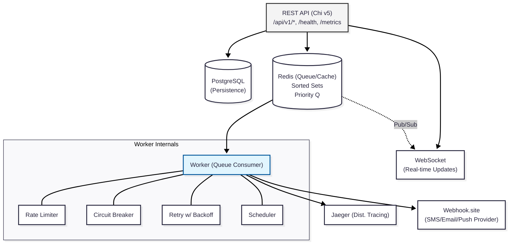
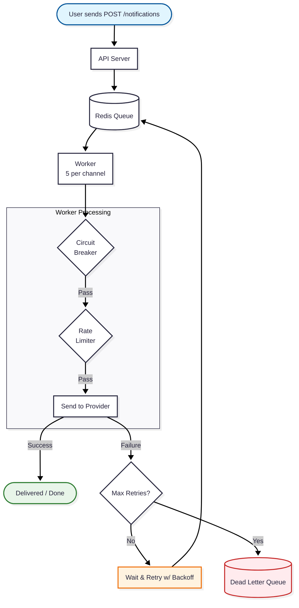
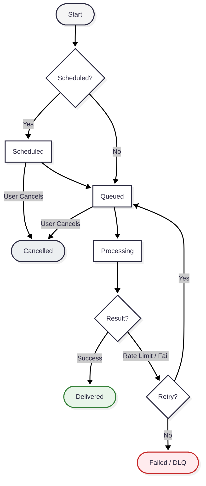

# Event-Driven Notification Service

A scalable, event-driven notification system built in Go that processes and delivers messages through multiple channels (SMS, Email, Push) with priority queues, retry logic, circuit breakers, and real-time status tracking.

## Architecture



The system follows **Hexagonal Architecture (Ports & Adapters)** with two separate binaries (`cmd/api` + `cmd/worker`) that scale independently:

```
├── cmd/
│   ├── api/              # HTTP server binary (chi router, graceful shutdown)
│   └── worker/           # Queue consumer binary (multi-channel, concurrent)
├── internal/
│   ├── domain/           # Entities, value objects, errors (zero external imports)
│   ├── port/             # Interfaces (repository, queue, provider, cache, event)
│   ├── service/          # Business logic (notification, delivery, template, scheduler)
│   ├── adapter/
│   │   ├── handler/      # HTTP handlers + middleware
│   │   ├── repository/   # PostgreSQL implementations + migrations
│   │   ├── queue/        # Redis sorted set publisher/consumer
│   │   ├── provider/     # Webhook HTTP client
│   │   ├── cache/        # Redis cache
│   │   └── event/        # WebSocket hub + Redis Pub/Sub bridge
│   └── config/           # Configuration (Viper)
├── pkg/
│   ├── circuitbreaker/   # Per-channel circuit breaker state machine
│   └── ratelimit/        # Sliding window rate limiter (Redis + Lua)
├── api/                  # OpenAPI 3.0 specification
├── deployments/          # Docker Compose, Dockerfiles, nginx config
├── scripts/              # Integration test scenarios
└── .github/workflows/    # CI/CD pipeline
```

## Features

### Notification Management API
- **Multi-channel delivery**: Create notification requests with recipient, channel, content, and priority (SMS, Email, Push)
- **Batch creation**: Up to 1000 notifications in a single request
- **Status tracking**: Query notification status by ID or batch ID.
- **Cancellation**: Cancel pending notifications.
- **Advanced querying**: List notifications with filtering (status, channel, date range) and pagination.

### Processing Engine
- **Asynchronous processing**: Process notifications asynchronously via Redis queue workers.
- **Rate limiting**: Configurable per-channel limit (default: 100 msg/sec) using sliding window
- **Priority queues**: High, Normal, Low — urgent messages are processed first
- **Content validation**: Channel-specific limits (SMS: 1600 chars, Push: 4096, Email: 100K)
- **Idempotency**: Duplicate send prevention via idempotency keys

### Observability
- **Real-time metrics**: Endpoint exposing queue depth, success/failure rates, latency, and circuit breaker states.
- **Structured logging**: JSON logs with correlation IDs (`log/slog`)
- **Health check**: Endpoint monitoring Postgres and Redis connectivity.

### Bonus Features
- **Failure Handling**: Retry, Circuit Breaker, Dead Letter Queue, Delivery audit trail, Graceful shutdown
- **Scheduled notifications**: Future delivery with `scheduled_at`
- **Template system**: Go `text/template` with variable substitution and preview
- **WebSocket updates**: Real-time status events via Redis Pub/Sub bridge
- **Distributed tracing**: OpenTelemetry + Jaeger across API → Queue → Worker
- **GitHub Actions CI/CD**: Lint, test, build, Docker pipeline

### Reliability
- **Exponential backoff retry**: With jitter to prevent thundering herd
- **Circuit breaker**: Per-channel failure isolation with automatic recovery
- **Dead Letter Queue**: Failed messages preserved with full context for manual review
- **Delivery audit trail**: Every attempt recorded with latency, status code, and error details
- **Graceful shutdown**: Clean connection draining on SIGTERM

## Delivery & Retry Logic (Design)

> This section explains the design thinking behind the delivery subsystem — the problem each component solves, why it was chosen, and how the pieces fit together.


The delivery subsystem was built around four principles:

1. **No message left behind** — A notification should be delivered or explicitly marked as permanently failed. Nothing silently disappears.
2. **Prevent cascading failures** — When a provider is struggling, avoid hammering it with retries to give it room to recover.
3. **Isolate failures** — SMS provider going down shouldn't affect email or push delivery.
4. **Full visibility** — Every delivery attempt is recorded. When something goes wrong, you can trace exactly what happened.

### How a Notification Flows Through the System



**Step by step:**

1. The API validates the request and stores the notification in PostgreSQL
2. It's enqueued to Redis with a priority score (high-priority messages go first)
3. A worker picks it up and runs it through a safety pipeline:
   - **Circuit breaker**: Is this channel healthy? If not, skip and retry later
   - **Rate limiter**: Are we sending too fast? If so, put it back in the queue
   - **Provider call**: Actually send the message via HTTP
4. If the provider returns success → mark as `delivered`, done
5. If the provider returns an error → schedule a retry with increasing wait time
6. After all retries are exhausted → move to Dead Letter Queue for manual review

### Notification Lifecycle 

Every notification follows a defined lifecycle with explicit states:


**Final states** (`delivered`, `failed` with max retries, `cancelled`) are immutable — the system will not reprocess them.

### Retry Strategy: Exponential Backoff with Jitter

When a delivery fails, the system doesn't retry immediately. Instead, it waits — and each subsequent retry waits longer:

| Attempt | Wait Time |
|---------|-----------|
| 1st retry | ~1 second |
| 2nd retry | ~2 seconds |
| 3rd retry | ~4 seconds |
| 4th retry | ~8 seconds |
| ... | up to 5 minutes (cap) |

**Why wait longer each time?** If a provider is down, retrying every 2 seconds just adds load to an already struggling service. Exponential backoff gives the provider progressively more breathing room to recover.

**Why add randomness (jitter)?** Imagine a provider goes down for 10 minutes. During that time, 5000 notifications accumulate. When the provider comes back, all 5000 would retry at the exact same moment — potentially crashing it again. By adding ±20% random variation to each retry time, those 5000 retries spread out across a time window instead of hitting all at once.

### Retries Are Stored: Database, Not Memory

Failed notifications waiting for retry are stored in **PostgreSQL**, not in memory. A background process (Retry Poller) scans the database every 5 seconds for notifications whose retry time has arrived.

**Why not keep retries in memory?** If the worker process crashes or restarts (deployment, scaling, OOM), all in-memory retry timers are lost. Those notifications would never be retried. With database storage, the retry schedule survives any process restart — the new worker picks up right where the old one left off.

**Handling concurrent workers:** When multiple worker instances poll for retries simultaneously, PostgreSQL's `FOR UPDATE SKIP LOCKED` ensures each worker picks up different notifications. No duplicates, no contention.

### Circuit Breaker: Protecting Failing Channels

Each channel (SMS, Email, Push) has its own circuit breaker.

- **Per-channel isolation**: If the SMS gateway goes down, email and push remain healthy. One failing provider won't take down the entire system.
- **No data loss**: Notifications blocked by an OPEN circuit are simply scheduled for retry and re-enqueued once the provider recovers.

### Rate Limiting: Not Overwhelming the Provider

- **Sliding window algorithm**: Enforces a strict 100 msg/sec limit via atomic Redis Lua scripts, preventing traffic bursts at clock boundaries.
- **Flow control, not an error**: Rate-limited requests are re-enqueued without incrementing the failure counter, ensuring no false trips to the DLQ.

### Dead Letter Queue: When All Retries Are Exhausted

- **Final resting place**: After maximum retries (default: 3), failed notifications move to a separate DLQ database table for manual review.
- **State snapshots**: Preserves the exact message content and error trace at the exact moment of failure, preventing debugging issues if records change later.

### Delivery Attempts: Complete Audit Trail

Every single delivery attempt — successful or failed — is recorded:

```
Notification X:
  Attempt 1 │ failure │ "connection timeout"       │ 5023ms │ 2026-03-24 18:00:01
  Attempt 2 │ failure │ "provider returned 500"    │ 234ms  │ 2026-03-24 18:00:03
  Attempt 3 │ success │ provider_msg_id: "msg-001" │ 45ms   │ 2026-03-24 18:00:07
```

This gives full visibility into the delivery history of every notification.

### Priority Queue: Urgent Messages First

The queue uses Redis Sorted Sets with a scoring formula that combines priority and creation time:

```
score = priority_weight × 10^13 + creation_timestamp
```

| Priority | Queue Position |
|----------|---------------|
| high | Front (processed first) |
| normal | Middle |
| low | Back (processed last) |

Within the same priority level, messages are processed in FIFO order (first created, first sent). The dequeue operation is atomic via a Lua script, preventing two workers from grabbing the same message.

## Quick Start

### Prerequisites
- Docker & Docker Compose
- Go 1.26+ (for local development only)

### 1. Configure

```bash
cd deployments
cp .env.example .env
```

Edit `.env` and set your webhook URL:
- **For real testing**: Get a URL at [webhook.site](https://webhook.site) and paste it
- **For load testing**: Use `http://mockprovider` (included in Docker Compose)

### 2. Start

```bash
docker compose up -d
```

This single command starts all services: PostgreSQL 18, Redis 8.0, Jaeger, database migrations, API server, Worker, and a mock provider.

### 3. Verify

```bash
# Health check (should return {"status":"healthy","postgres":"up","redis":"up"})
curl http://localhost:8080/health | jq .

# Send your first notification (order confirmation)
curl -X POST http://localhost:8080/api/v1/notifications \
  -H "Content-Type: application/json" \
  -d '{
    "channel": "sms",
    "recipient": "+905551234567",
    "content": "Your order #ORD-78432 has been confirmed! Estimated delivery: Mar 27.",
    "priority": "high"
  }' | jq .
```

### Distributed Tracing
| Service | URL | Purpose |
|---------|-----|---------|
| Jaeger | http://localhost:16686 | Distributed tracing UI |

## API Documentation

Full OpenAPI 3.0 specification is available at [`api/openapi.yaml`](api/openapi.yaml).

### Endpoints Overview

| Method | Endpoint | Description |
|--------|----------|-------------|
| `GET` | `/health` | Health check (Postgres + Redis) |
| `GET` | `/metrics` | Real-time delivery metrics |
| `GET` | `/ws/notifications` | WebSocket for live status updates |
| `POST` | `/api/v1/notifications` | Create a notification |
| `POST` | `/api/v1/notifications/batch` | Create up to 1000 notifications |
| `GET` | `/api/v1/notifications` | List with filtering & pagination |
| `GET` | `/api/v1/notifications/{id}` | Get notification by ID |
| `PATCH` | `/api/v1/notifications/{id}/cancel` | Cancel a pending notification |
| `GET` | `/api/v1/notifications/batch/{batchId}` | Get all notifications in a batch |
| `PATCH` | `/api/v1/notifications/batch/{batchId}/cancel` | Cancel entire batch |
| `POST` | `/api/v1/templates` | Create a message template |
| `GET` | `/api/v1/templates` | List templates |
| `GET` | `/api/v1/templates/{id}` | Get template by ID |
| `PUT` | `/api/v1/templates/{id}` | Update template |
| `DELETE` | `/api/v1/templates/{id}` | Soft-delete template |
| `POST` | `/api/v1/templates/{id}/preview` | Preview rendered template |

### API Examples

**Create a notification (order confirmation via SMS):**
```bash
curl -X POST http://localhost:8080/api/v1/notifications \
  -H "Content-Type: application/json" \
  -d '{
    "channel": "sms",
    "recipient": "+905551234567",
    "content": "Your order #ORD-78432 has been confirmed! Estimated delivery: Mar 27. Track at shop.example.com/track/78432",
    "priority": "high"
  }'
```

**Schedule a flash sale announcement:**
```bash
curl -X POST http://localhost:8080/api/v1/notifications \
  -H "Content-Type: application/json" \
  -d '{
    "channel": "sms",
    "recipient": "+905559999999",
    "content": "FLASH SALE starts NOW! 60% off all items for the next 2 hours. Shop now: shop.example.com/flash-sale",
    "priority": "high",
    "scheduled_at": "2026-03-25T09:00:00Z"
  }'
```

**Batch send (Spring Sale campaign):**
```bash
curl -X POST http://localhost:8080/api/v1/notifications/batch \
  -H "Content-Type: application/json" \
  -d '{
    "notifications": [
      {"channel": "sms", "recipient": "+905551111111", "content": "Spring Sale! 40% off all electronics. Use code SPRING40.", "priority": "high"},
      {"channel": "email", "recipient": "vip@example.com", "content": "Exclusive VIP Early Access: Spring Collection is here.", "priority": "high"},
      {"channel": "push", "recipient": "device-token-42", "content": "Price drop alert! Your wishlist item is now 30% off.", "priority": "normal"}
    ]
  }'
```

**Idempotent send (prevents duplicate order confirmations):**
```bash
curl -X POST http://localhost:8080/api/v1/notifications \
  -H "Content-Type: application/json" \
  -H "X-Idempotency-Key: order-ORD-44510-confirm" \
  -d '{
    "channel": "sms",
    "recipient": "+905551234567",
    "content": "Your order #ORD-44510 has been confirmed. Total: $89.99. Thank you for shopping with us!",
    "idempotency_key": "order-ORD-44510-confirm"
  }'
```

**List with filters:**
```bash
curl "http://localhost:8080/api/v1/notifications?status=delivered&channel=sms&page=1&page_size=10"
```

**Cancel a notification:**
```bash
curl -X PATCH http://localhost:8080/api/v1/notifications/{id}/cancel
```

**Create and use a template (order confirmation):**
```bash
# Create template
curl -X POST http://localhost:8080/api/v1/templates \
  -H "Content-Type: application/json" \
  -d '{
    "name": "order_confirmation",
    "channel": "email",
    "subject": "Order #{{.order_id}} confirmed - {{.customer_name}}!",
    "content": "Hi {{.customer_name}}, thank you for your order #{{.order_id}}! Total: ${{.total}}. Estimated delivery: {{.delivery_date}}.",
    "variables": [
      {"name": "customer_name", "required": true},
      {"name": "order_id", "required": true},
      {"name": "total", "required": true},
      {"name": "delivery_date", "required": false, "default_value": "3-5 business days"}
    ]
  }'

# Send notification using template
curl -X POST http://localhost:8080/api/v1/notifications \
  -H "Content-Type: application/json" \
  -d '{
    "channel": "email",
    "recipient": "john.doe@example.com",
    "template_id": "TEMPLATE_ID_HERE",
    "template_vars": {"customer_name": "John Doe", "order_id": "ORD-99201", "total": "149.99", "delivery_date": "March 28, 2026"},
    "priority": "high"
  }'
```

**WebSocket real-time updates:**
```javascript
const ws = new WebSocket('ws://localhost:8080/ws/notifications');
ws.onmessage = (e) => {
  const event = JSON.parse(e.data);
  console.log(`${event.notification_id}: ${event.status}`);
  // Output: "abc-123: queued" → "abc-123: processing" → "abc-123: delivered"
};
```

**Metrics:**
```bash
curl http://localhost:8080/metrics | jq .
```
```json
{
  "queue_depth": {"sms": 0, "email": 0, "push": 0},
  "delivered": 1523,
  "failed": 12,
  "total_processed": 1535,
  "avg_latency_ms": 0.45,
  "circuit_breakers": {},
  "timestamp": "2026-03-24T18:00:00Z"
}
```

## Configuration

1. **Environment variables** (prefix: `NOTIFY_`) — for deployment and Docker
2. **config.yaml** — committed with safe defaults for local development
3. **Code defaults** — fallback values

| Variable | Default | Description |
|---|---|---|
| `NOTIFY_SERVER_PORT` | `8080` | API server port |
| `NOTIFY_DB_HOST` | `localhost` | PostgreSQL host |
| `NOTIFY_DB_PORT` | `5432` | PostgreSQL port |
| `NOTIFY_DB_USER` | `postgres` | Database user |
| `NOTIFY_DB_PASSWORD` | - | Database password |
| `NOTIFY_DB_NAME` | `notifications` | Database name |
| `NOTIFY_REDIS_ADDR` | `localhost:6379` | Redis address |
| `NOTIFY_PROVIDER_WEBHOOK_URL` | - | Webhook provider URL |
| `NOTIFY_WORKER_CONCURRENCY` | `5` | Workers per channel |
| `NOTIFY_WORKER_RATE_LIMIT` | `100` | Max messages/sec/channel |
| `NOTIFY_WORKER_MAX_RETRIES` | `3` | Max delivery retries |
| `NOTIFY_WORKER_RETRY_BASE_DELAY` | `1s` | Initial retry delay |
| `NOTIFY_WORKER_RETRY_MAX_DELAY` | `5m` | Maximum retry delay cap |
| `NOTIFY_TRACING_ENABLED` | `true` | Enable OpenTelemetry tracing |
| `NOTIFY_TRACING_ENDPOINT` | `localhost:4318` | Jaeger OTLP endpoint |

## Database Migrations

Versioned schema changes using [golang-migrate](https://github.com/golang-migrate/migrate):

| Version | Migration | Description |
|---------|-----------|-------------|
| 000001 | `create_notifications` | Core notifications table with status state machine |
| 000002 | `create_templates` | Message templates with Go template syntax |
| 000003 | `create_delivery_attempts` | Audit trail for every delivery attempt |
| 000004 | `create_dead_letter_queue` | Failed notifications after max retries |

Migrations run automatically on `docker compose up`. For manual control:

```bash
make migrate-up       # Apply all pending migrations
make migrate-down     # Rollback last migration
```

## Development & Testing

```bash
# Run unit tests (single command)
make test

# Run with coverage report
make test-coverage

# Lint
make lint

# Build binaries
make build

# Run locally (requires Postgres + Redis)
make run-api          # Start API server
make run-worker       # Start worker (separate terminal)

# Docker
make docker-up        # Start all services
make docker-down      # Stop all services
```

### Integration Tests

End-to-end integration tests run against a live environment (Docker Compose):

```bash
# Start services first
docker compose -f deployments/docker-compose.yml up -d

# Run all integration test scenarios
./scripts/run-integration-tests.sh all

# Run individual scenarios
./scripts/run-integration-tests.sh health       # Health check
./scripts/run-integration-tests.sh single       # Single notification (SMS, Email, Push)
./scripts/run-integration-tests.sh batch        # Batch send (5 messages)
./scripts/run-integration-tests.sh template     # Template create + preview + send
./scripts/run-integration-tests.sh schedule     # Scheduled delivery (15s delay)
./scripts/run-integration-tests.sh cancel       # Create and cancel notification
./scripts/run-integration-tests.sh priority     # Priority queue ordering
./scripts/run-integration-tests.sh idempotency  # Duplicate prevention
./scripts/run-integration-tests.sh websocket    # Real-time WebSocket events
./scripts/run-integration-tests.sh list         # List & filter notifications
./scripts/run-integration-tests.sh metrics      # Metrics & observability

# Load test (500 messages, 20 concurrent)
./scripts/run-integration-tests.sh load 500 20
```

### CI/CD

GitHub Actions pipeline (`.github/workflows/ci.yml`) runs on every push and PR:

1. **Lint** — golangci-lint
2. **Test** — `go test -race` with coverage
3. **Build** — Compile both binaries (API + Worker)
4. **Docker** — Build Docker image (on main branch push)
